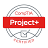

<div align="center">
  
</div>

<h3 align="center">Hello, I am Jarad </h3>

<div align="center">
  I'm a <strong>Staff SRE</strong> and am ✨ passionate ✨ about process improvement. 
  You can find me listening to podcasts, reading developer blogs and generally trying to find something fun to do. 
  Currently mentoring several up and coming developers.

  Refer to: <a href="https://github.com/MisterBianco">this profile</a> for my personal account
</div>

<hr>

<div align="center">
  
  
  
  
  
  
  
  
</div>

<hr>

<!-- <h3>🌎 Bio</h3> -->

<h3>📚 Certifications</h3>

<code></code>
<a href="https://www.credential.net/6c68fdea-8564-4915-a3eb-22563436cf4a">Chaos Engineering Practitioner</a> <br>
<code></code>
<a href="https://www.credential.net/6c68fdea-8564-4915-a3eb-22563436cf4a">Comptia Project+</a>

<h3>🛠 Hardware and Software</h3>

```
> sysfetch

user@D4RT3R
---------------
💾 OS: Manjaro Linux x86_64
💻 Host: D4RT3R
🌽 Kernel: 5.12.10-1-MANJARO
💽 Shell: zsh 5.8
🖥️ DE: GNOME 40.2
```

<div>
  
</div>


